# Design Document: 3D Printing Online Store
### **1. Introduction**
#### **1.1 Purpose**
This document describes the architecture and detailed design for the 3D Modeling Online Store, a web-based application for Customer orders and inventory tracking. All Business requirements will be converted into technical designs to utilize the models for front and backend implementation.
#### **1.2 Scope**
- Responsive frontend to allow efficiency on User navigation and system interaction
- Simplified product selection and customization for better usability
- Real-time calculations for cost and delivery
- Maintainable storage and security of User account details
- Inventory tracking for resupply and stock management
- Automated order payment to decrease manual processing
#### **1.3 Definitions**

| Definition | Description |
| -------- | -------- |
| Business | The User (client) accessing the online store from the backend UI |
| Customer | The User (customer) accessing the online store from the frontend UI |
| System | The automated functions processed in the backend |
| Table | The backend database used for tracking orders, inventories, 3d models, and Customer profiles |
| |

### **2. System Architecture**
#### **2.1 High-Level Architecture**
3D Printing Online Store follows a three-tier architecture:

| Layer | Architecture | Description |
| ----- | ----- | -----| 
| Presentation | Frontend | User Interface for User interaction |
| Application | Backend | Controllers for navigation and calculations
| Data | Database | Repository for asset management and tracking

#### **2.2 Technology Stack**
- **Frontend:** Next.js (React)
  - Handle responsive and interactive web application
- **Backend:** Python
  - Handle server logic, data processing, and communication with the database.
- **Styling:** HTML, Tailwind CSS
  - Handle modernized visuals and navigation
- **Database:** MariaDB (MySQL)
  - Store and manage application data efficiently
- **Version Control:** GitHub
  - Maintain code-base changes and revisions
- **Unit Testing:** Python unittest library
  - Ensure code coverage meets expected target

### **3. Detailed Design**
#### **3.1 Product Categories**
3D Printing Online Store organizes its product catalog into primary categories, each targeting distinct classifications of an object. Categories are designed to allow easier filtering between product selections.

|Category| Description| Example Products|
|-|-|-|
|Utilties|Components requiring precision, strength, or specific tolerances|Hammer, Gears|
|Gaming|Miniature game pieces, terrains, or accessories|Chess Piece, Chess Board|
|Collectibles|Statues, models, figurines, and artistic designs|Batman Figurine, Mini Batmobile|
|Props|Replicas of accessories from movies or games|Top Hat, Wilson Volleyball|
|Decorations|Functional how organizational tools|Vase, Ornaments|
|Education|Visualization models, architectural mockups, or model scans|Mini Globe, Stacking Blocks|

#### **3.2 Materials & Finishes**
3D Printing Online Store supports different material finishes to allow full customization of a 3d print and instant quotation based on material pricing.

|Material| Properties| Available Colors|
|-|-|-|
|PLA|Polylactic Acid - Environmentally friendly filament derived from renewable resouces|Green, Blue, Purple, Red, Orange, Grey, Black, White|
|PETG|Polyethylene Terephthalate Glycol - Durable, semi-rigid, and chemically resistant plastic known for minimal warping and strong layer adhesion, making it ideal for functional parts. |Green, Blue, Purple, Red, Orange, Grey, Black, White|
|ABS|Acrylonitrile Butadiene Styrene - Tough and durable thermoplastic, ideal for functional, high-temperature, or high-wear parts like LEGO blocks or auto components |Green, Blue, Purple, Red, Orange, Grey, Black, White|
|TPU|Thermoplastic Polyurethane - Flexible, durable, and rubber-like filament|Green, Blue, Purple, Red, Orange, Grey, Black, White|

#### **3.3 Product Attributes**
Every Product listed on 3D Printing Online Store contains comprehensive attributes to enable purchasing descisions and accurate description of product selection.
- Name: Displays the name of the Product
- Description: Description of the Product
- Image: An image preview of the Product showing detailed shots
- Category: Classifies the Product to a catalog group
- Material: Available material selections associated with price modifiers
- Color: Available color selections associated with material selection
- Dimensions: Physical dimensions of the model calculated by 3d model bounding box
- Tags: Classifies the Product to increase searchability and filtering
- Scaling: Increase or decrease the size of a print maintaining original dimensions
- Price: Starting price of a Product before customizing print attributes
- Quantity: Amount of prints required for selected Product

### **4. User Flow**
The following flow will represent the primary interaction paths through the 3D Printing Online Store. Each step will guide the User towards successful completion.

#### 4.1 **Browse & Purchase Products**
1. Landing Page: User arrives at the 3D Printing Online Store, presented with a Product Catalog, filters, and menu navigation.
2. Browser Products: User navigates through the product tiles, applies filters, or selects tags.
3. Product Detail Page: User views the Product by selection, views the attributes of the products, selects the options available for customization, and views a real-time quotation.
4. Add To Cart: User selects quantity and adds item to Cart, redirected to the Cart page.
5. Cart Review: User views a list of items selected, item quantities, and removal of items.
6. Checkout: User required to login to system, entering payment details, and mailing address.
7. Order Confirmation: User views a list of processed orders and status updates.

#### 4.2 **Browse & Customize Products**
1. Landing Page: User arrives at the 3D Printing Online Store, presented with a Product Catalog, filters, and menu navigation.
2. Browser Products: User navigates to custom Products option.
3. Update Model: User uploads a file, system displays the custom model.
4. Product Detail Page: User views the Product by selection, views the attributes of the products, selects the options available for customization, and views a real-time quotation.
5. Add To Cart: User selects quantity and adds item to Cart, redirected to the Cart page.
6. Cart Review: User views a list of items selected, item quantities, and removal of items.
7. Checkout: User required to login to system, entering payment details, and mailing address.
8. Order Confirmation: User views a list of processed orders and status updates.

#### 4.3 **Account Management**
1. Register: User creates an account with a Username and Password.
2. Profile Management: User navigates to profile, updates name, email, payment methods, and mailing address.
3. Order History: User views list of past orders with invoice and order status.

#### 4.4 **User Capabilities**
|Capability| Customer| Admin|
|-|-|-|
|Browser product catalog|Yes|Yes|
|Search products|Yes|Yes|
|Filter products|Yes|Yes|
|Sort products|Yes|Yes|
|View & select products|Yes|Yes|
|Upload standard 3D models|No|Yes|
|Upload custom 3D models|Yes|Yes|
|View & select product properties|Yes|Yes|
|Add & remove product properties|No|Yes|
|Purchase product|Yes|Yes|
|Track orders|Yes|Yes|
|Access order dashboard|No|Yes|
|Update inventory stock|No|Yes|
|Create profile|Yes|Yes|
|Edit profile|Yes|Yes|
|Delete profile|No|Yes|

#### 4.5 **Key UI Components**
**- 3D Model Preview**

The Product selected by User will display a preview of the 3D Model. Users can toggle between available materials and colors for real-time renders of the model.

**- Real-Time Quote Calculator**

The Product selected by User will determine the estimated price, print time, and cost breakdowns for the corresponding property selections. Different materials and shipping methods will drive cost surcharges.

|Type|Description|Calculation|
|-|-|-|
|Base Price|The Base Price of the selected Product|Standard Price Set|
|Material|The cost of Material used for Product|Manufacture Costs|
|Printing Costs|The cost of running a Printer|$10 per Hour|
|Scaling|The cost of rescaling a model|2.375g per gram for 50% Increase|
|Dimensions|The cost of printing per cubic square|100 cubic mm = 100g Material|
|Overhead|Indirect costs like wear and tear|15% Surcharge|
|Waste|The cost of wasted printing waste|20% Estimated|
|Multi-Color Printing|The cost of using multiple materials in a print|5% Surcharge|
|Shipping|The cost of shipping orders within Canada|$10 Flat Rate|

**- Product Tiles**

The User will be presented Products through a grid tile, displaying thumbnail images and descriptions of each available item.

**- Custom File Upload**

The User will be uploading Custom Models through a file upload component. The uploaded file will be stored in the backend database to be used through the order lifecycle.

**- Product Configuration**

The User will be presented a variety of selections available for the Product to customize their prints. Material and color selections determine majority of the cost calculations.

**- Check Out Screen**

The User will be presented with a payment screen which allows fluid interactions between payment and ordering.

### **5. Database Schema/Data Models**
- User: user_id, username, password, name, email, phone_number, city, street, province, postal_code.
- Role: role_id, role_name(admin, customer, staff).
- User_Role: user_id(PK, FK > User), role_id(PK, FK > Role).
- Tag: tag_id, tag_name.
- Printer: printer_id, printer_name, max_length, max_width, max_height, printer_quantity.
- Color: color_id, color_name.
- Filament: filament_id, color_id(FK > Color), material_name, quantity_in_stock, manufacturer, more_wear_and_tear, filament_price.
- Model: model_id, filament_id(FK > Filament), tag_id(FK > Tag), printer_id(FK > Printer), model_name, is_customized, model_file.
- Product: product_id, model_id(FK > Model), infill_percent, length, width, height, scale, description, price
- Order_Header: order_header_id, user_id(FK > User), order_date, completion_date, shipping_date, status, shipping_price, extra_fee, total_price, order_tracking_number.
- Order_Detail: order_detail_id, order_header_id(FK > Order_Header), product_id(FK > Product), order_quantity, sub_total.

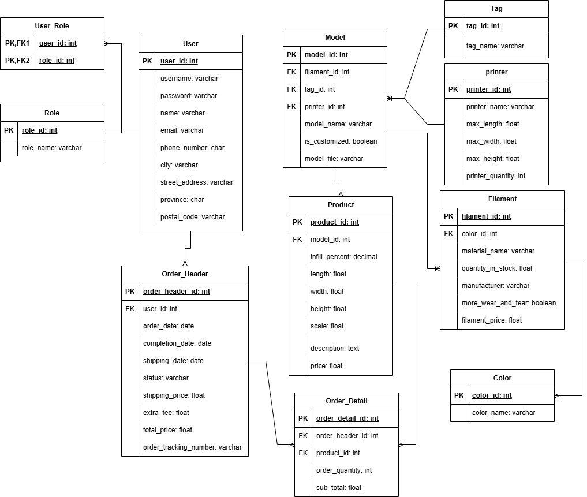

### **6 Wireframes**
Users will be presented with the following pages for the structure of navigation. 

**Homepage**
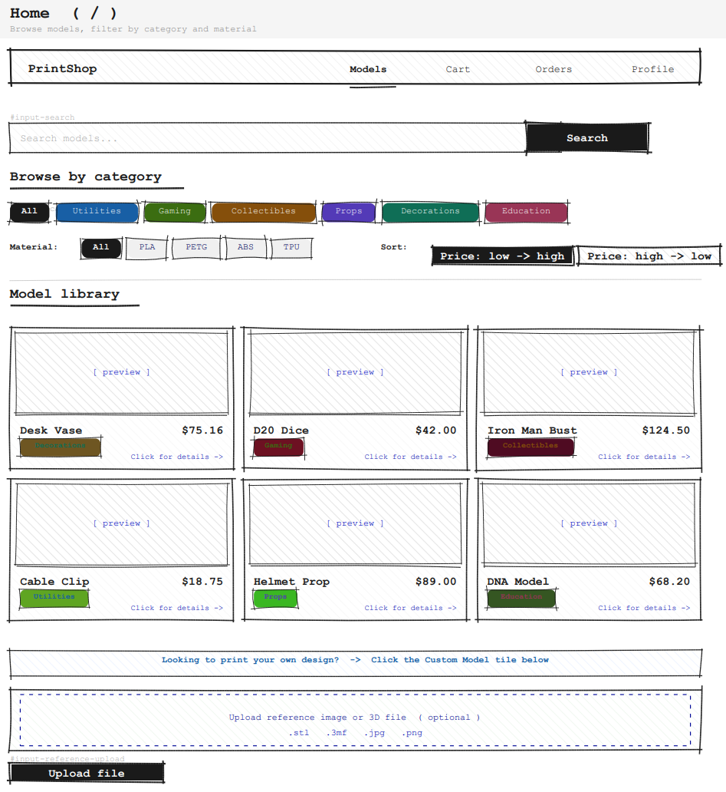

**Account Login**
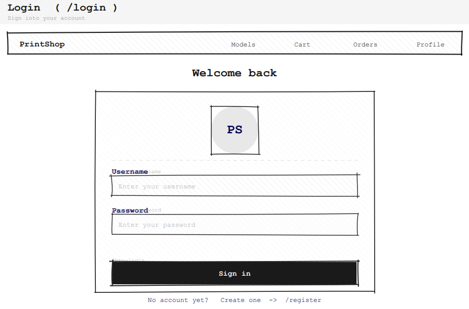

**Account Register**
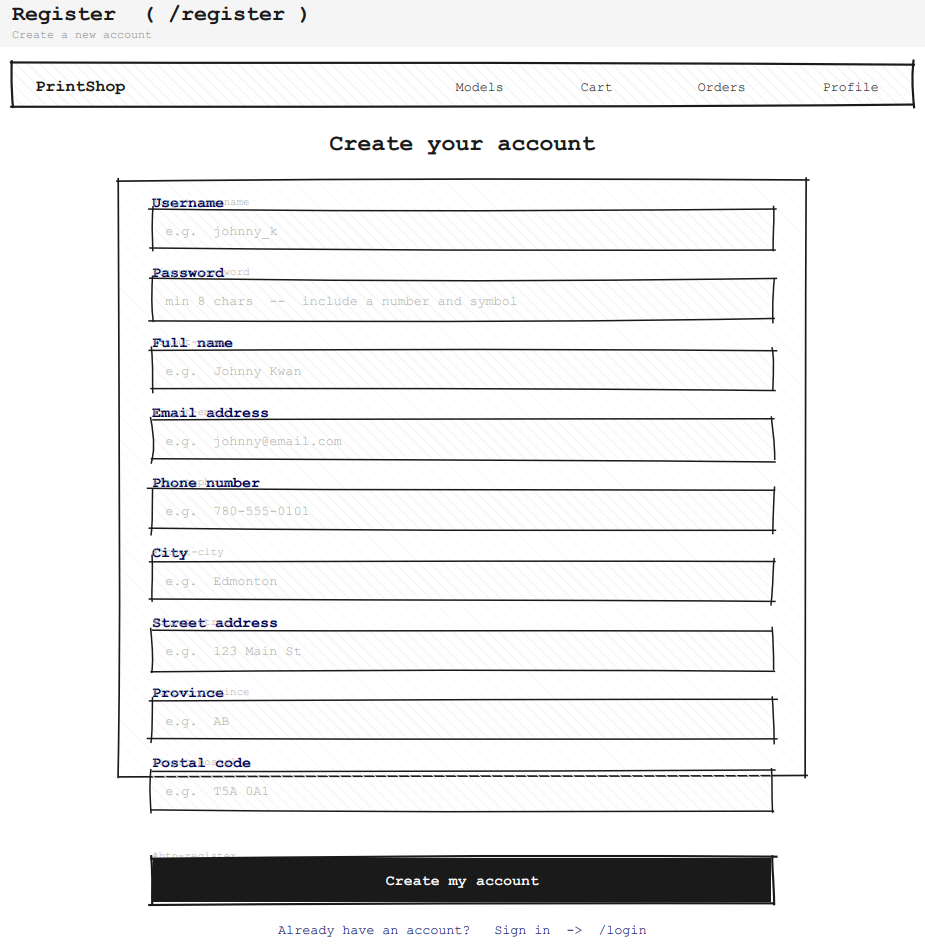

**Custom Product Upload**

**Product Configuration**
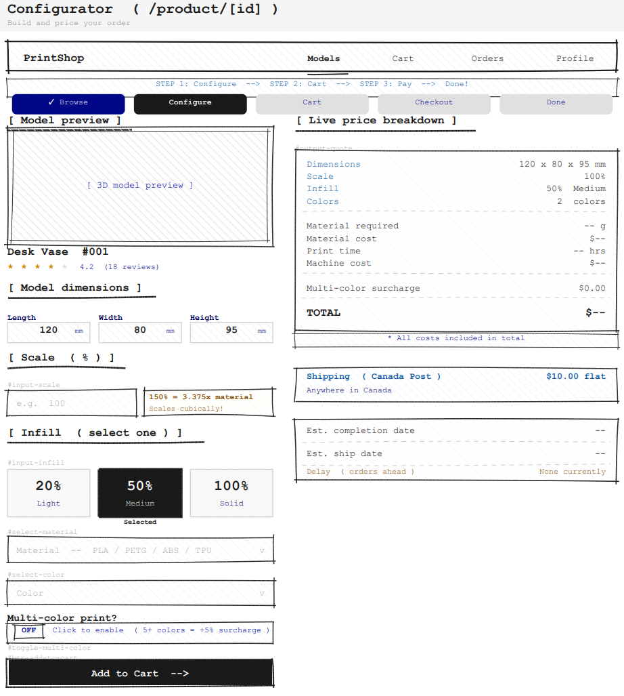

**Cart**
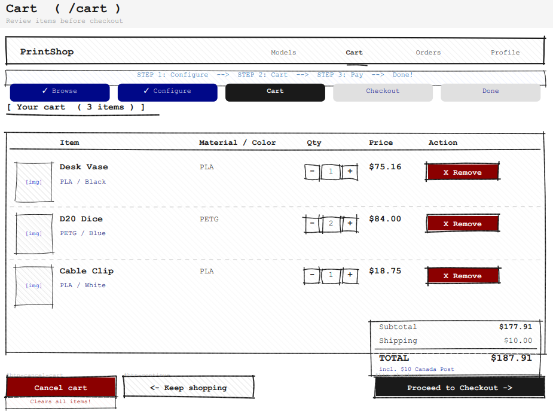

**Checkout**
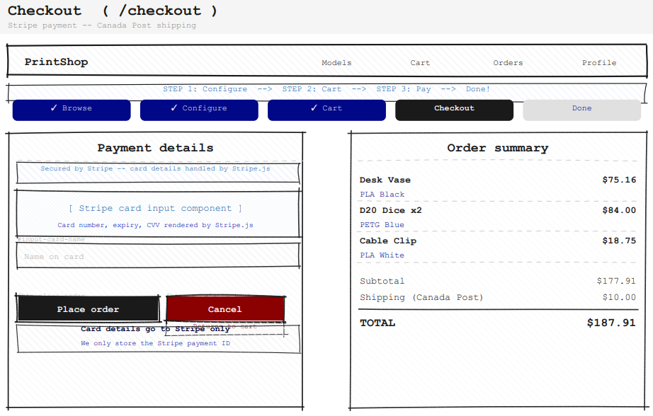

**Order Tracking**
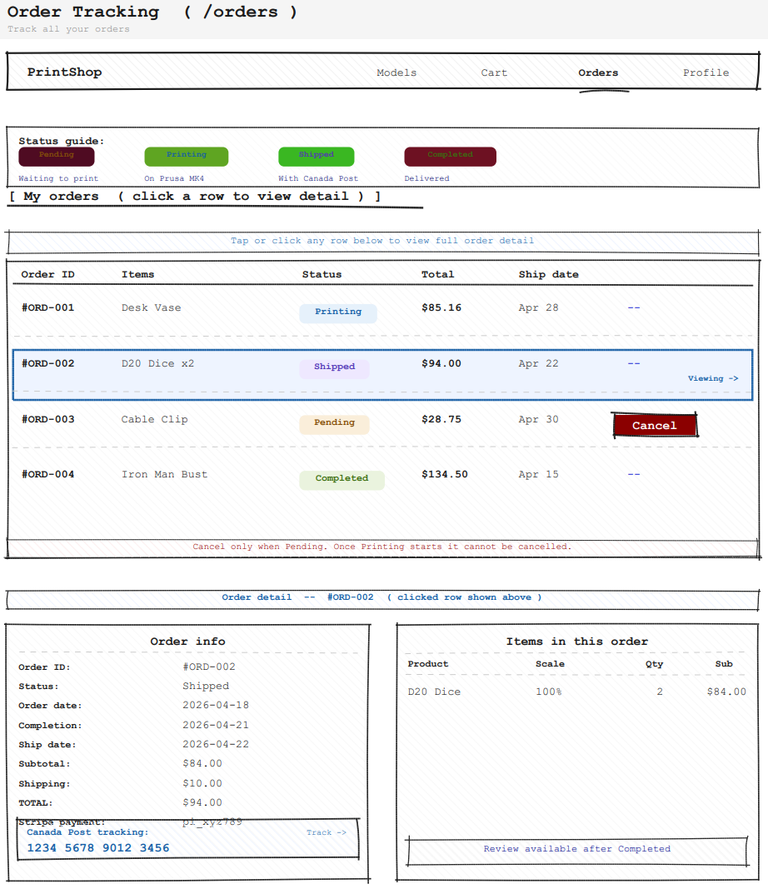

**User Profile**
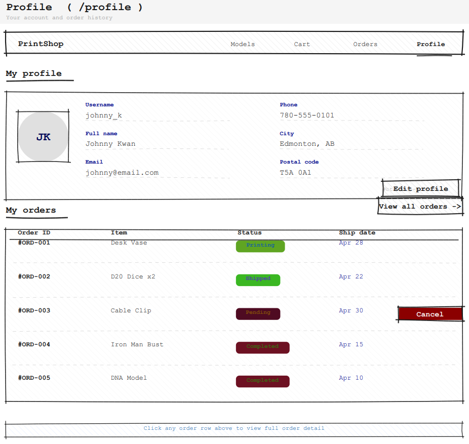

**Edit Profile**
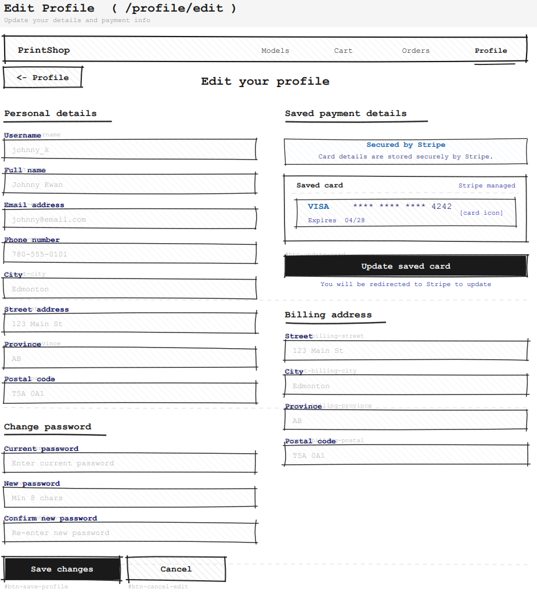

**Admin Dashboard**
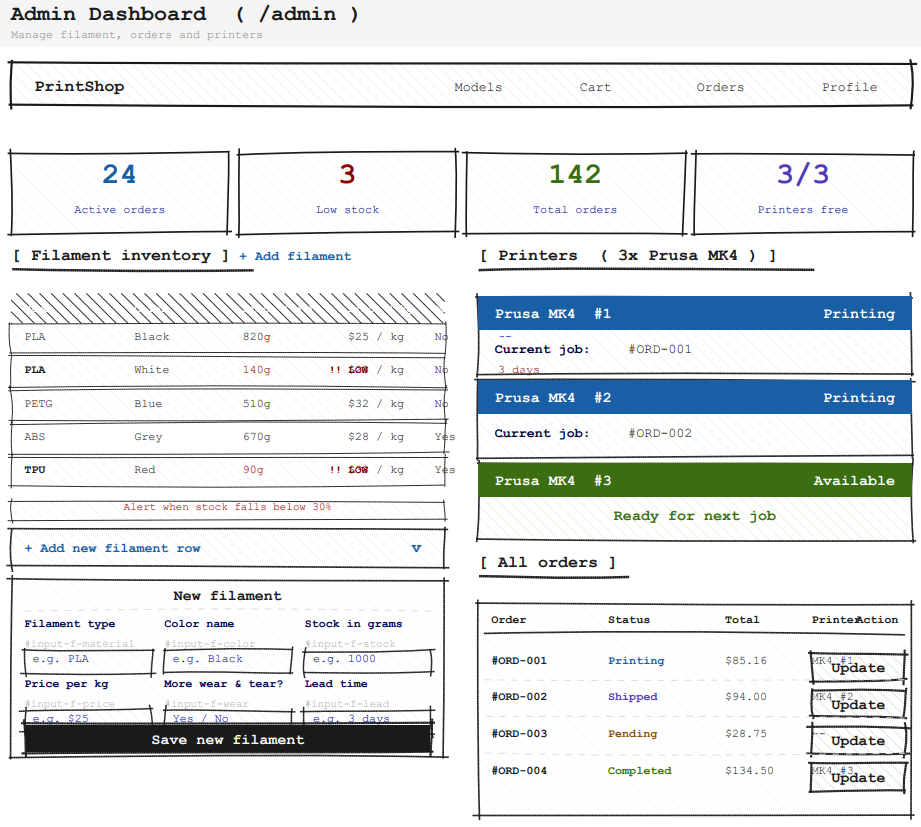

### **8. Timeline and Milestones**
- Week 1: Scope draft, design draft
- Week 2: ERD Mapping draft, wireframes draft, test plans draft
- Week 3: Finalize ERD, wireframes, test plans
- Week 4: Database creation
- Week 5: Frontend and backend creation
- Week 6: Final Product